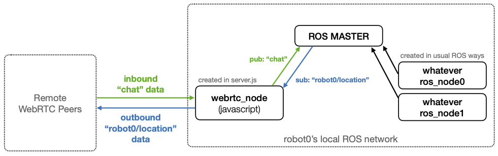

# ROS Example Overview

This example is written to provide an idea of how to develop a client ROS
application. It's an extension of the chat app with the following ROS
functionality:
1. remotely running ROS launch files
2. sending ROS messages
3. remotely stopping ROS processes

To try out this example, you do need to have already installed ROS and
`rosbridge_server`. Since ROS is still most stably supported on Ubuntu, it's
recommended you try this example out on Ubuntu. The example was most recently
tested using [ROS Melodic](http://wiki.ros.org/melodic). After you have
installed ROS, to install `rosbridge_server`, run
```bash
sudo apt install ros-melodic-rosbridge-server
```

Then, to try out the example, run
```bash
yarn ros
```
For more details on how to use the application, see the example at the bottom.
**Note**, this overview assumes you are familiar with ROS already. Also, we
purposefully do not include a ROS package in this example for the sake of
simplicity.

## Configuration
In `ros_config.json`, you will find an example configuration of the
application's inbound and outbound ROS topics. This json file is sent to your
peer when you remotely run a launch file. When the json file is received and
the ROS network has finish setting up, the json file is used automatically to
create the publications and subscriptions of the ROS node embedded in the
javascript application. It's important to understand that the application spins
up a ROS node of it's own, in addition to the nodes spun up by the launch file.

We have purposefully chosen to use the terms `inbound` and `outbound` as opposed
to the more typical `publication` and `subscription`. This is due to the fact
that the ROS node embedded in the application is used primarily to perform
forwarding, similar to
[bridges in networking](https://en.wikipedia.org/wiki/Bridging_(networking)#Forwarding).
We can take an example from the config file in this repo, `ros_config.json` for
a clearer explanation:
```json
"robot0": {
    "webrtc_node_inbound": [
        {"namespace": "", "topic": "chat", "ros_message_type": "std_msgs/String"}
    ],
    "webrtc_node_outbound": [
        {"namespace": "robot0/", "topic": "location", "ros_message_type": "geometry_msgs/Point"}
    ]
}
```
In this configuration, we specify that we want `robot0` to have an inbound topic
called `chat` and an outbound topic called `robot0/location`. With this
configuration, the application will automatically create ROS publishers and
subscribers to support the desired configuration. A publisher will be created to
locally publish inbound `chat` data received from a remote peer. `chat` is an
`inbound` topic because the data flows from remote peers into the local network.
Then, a subscriber will be created to locally listen for `robot0/location` data
and has a auto-generated callback function that will send the data outwards to
remote peers. `robot0/location` is an `outbound` topic because data flows from
the local network out to the remote peers. The network formed by this
configuration can be seen in the following diagram, where we have colored the
inbound data stream green and the outbound data stream blue:



## Example application use
Open up two terminal windows. In each, run
```bash
yarn ros
```
You will first be asked to pick a node name. In one terminal, pick `robot0`, in
the other, pick `robot1`. Then, when asked if you want to connect to the
signaling server, accept (for both).

You will then be prompted the following:
```bash
? Possible actions-
 [1] Run a launch file
 [2] Send a ROS message
 [3] Stop ROS
 Choose a number:
```
On one of the terminal windows, input `1` to launch a file on the other robot.
Then, for the name of the launch file write:
```bash
? Name of launch file: examples/ros/example.launch
```
You should be returned the option to run the launch file on the other robot. If
you don't, try once more and it should give the option on the second try. If you
don't see it on the second try, your signalling server might not be set up
correctly.

When you run the launch file on the other robot, you should see print outs on the
other terminal window about the ROS launch and the subscriptions and publications
created. Then, in new terminal window, you should be able to see the topics from
`ros_config.json` in the output of `rostopic list`.

If you see the configured topics, then you can try sending a message! On a new
terminal window, prepare for the message by running `rostopic echo` on the topic
you will be sending the message to. For this example, run `rostopic echo chat`.
Then, in the original terminal window where you remotely ran the launch file
from, select action `[2] Send a ROS message`.

Then, input the following:
```
? ROS topic name:  chat
? ROS message (in JSON format):  {"data": "Hello World"}
```
and send it off! Then, you should see a `"Hello World"` message in the window
where you ran `rostopic echo`.

To stop the remote launch file, use action `[3] Stop ROS`.
